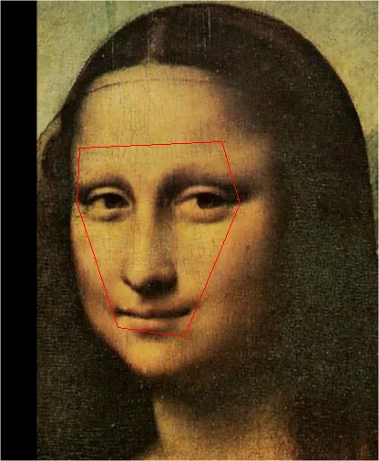

# DIP第二次作业报告
## 1. Poisson图像编辑
主要任务是补全create_mask_from_points与cal_laplacian_loss中的代码. 
### 1. 1. 补全create_mask_from_points
create_mask_from_points的主要功能是将点围住的范围以内赋值255, 以外赋值0, 也就是说返回一个面具以遮住没有被围住的部分. 本方法基于的数学原理是向量的叉乘. 若记该点集为$P=\left\{ P_1, P_2, . . . , P_n \right\}$, 则目标区域被以下向量(线段)所围:
$$a_1=\overrightarrow{P_1P_2}, a_2=\overrightarrow{P_2P_3}, . . . , a_n=\overrightarrow{P_nP_1}. $$
容易证明, 1. 一点$T$在区域内部, 等价于$\overrightarrow{P_iT}\times a_i$对一切的$i$均正或均负, 

2. 而$T$在边界, 等价于存在某个$i$使得此式为$0$, 

3. 不满足以上条件, 则点$T$在区域外部. 

由此即可实现此算法, 其核心是对图像的每一个点计算这些值, 此操作是可并行的. 
### 1. 2. 补全cal_laplacian_loss
cal_laplacian_loss的主要功能是计算混合后的图像与引导场的梯度距离, 其基于如下积分:
$$\int_{\Omega}{\left\| \nabla f-v \right\| ^2\mathrm{d}x}$$
将其离散后便得到laplacian_loss, 这里选择的引导场是source图像的梯度. 
### 1. 3. 程序运行结果
这里以蒙娜丽莎为例, 首先是原图

然后展示一下直接把另一张图覆盖到红框范围内, 可以见到此时两张图片的边界非常明显

但是使用Poisson图像编辑算法融合两张图片, 可以看到算法很好地融合了两张图

但是此融合仍有可以改进的地方, 可以看到蒙娜丽莎有很多因为纸质老化等原因造成的高频噪声, 而引导场是source图像的梯度, 因此红框里这些噪声全部被抹除, 想改进这方面可以考虑将引导场取为两张图像的梯度的最大值. 

## 2. Pix2Pix图像转换
主要任务是补全FCN_network中的代码. 
### 2. 1. 补全FCN_network
采用的数学算法是全卷积神经网络. 

1. 补充过程先是使用卷积不断降维, 并提取特征, 然后使用转置卷积超采样成原图大小的图像. 

2. 没有使用池化层. 

3. 使用的激活函数为两种, ReLU和tanh. 起初因为担心tanh丢失梯度因此用Softsign代替tanh, 但是发现效果并不好便弃用. 起初还使用过sigmoid, 但是发现亮度莫名其妙地高, 才知道是因为转换成图像的代码要求输入在-1到1之间, 于是也弃用. 

4. 尝试了3\*3和4\*4的卷积核. 
### 2. 2. 程序运行结果
首先是使用sigmoid训练的模型在训练集上的效果. 虽然亮度不对, 但是其确实可以很好地拟合训练集. 

然后是改用tanh后训练的模型. 此时可以看到对训练集的拟合效果很好, 但是对测试集拟合效果一般. 

为了优化过拟合问题, 减了若干层卷积后, 再次训练. 得到测试集上的图片, 只能看到一些轮廓, 但是比之前过拟合效果要稍好. 

