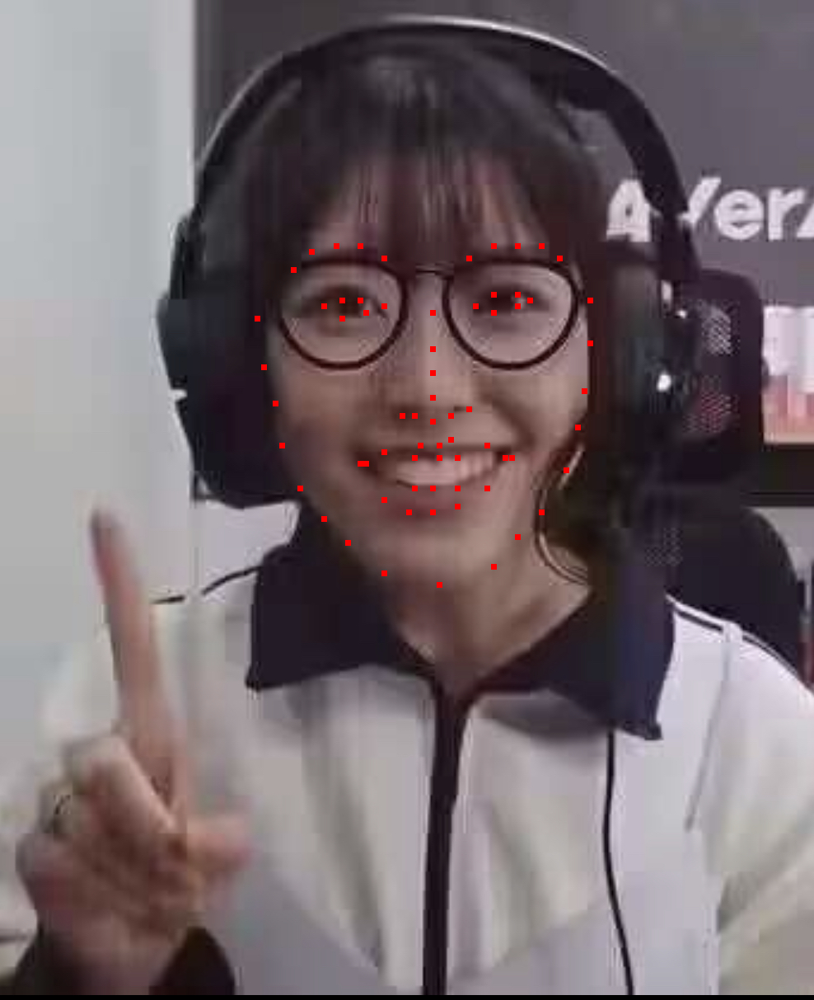

# Assignment3.1
第三次作业的第一个任务

## 需求

To install requirements:

```setup
pip install -r requirements.txt
bash download_facades_dataset.sh
```


## 训练

run this command:

```train
python train.py 
```


## 原理
使用assignment2的全卷积神经网络作为生成器，其loss函数选用1向量和判别器（生成器（原图））的L1范数。

另外新增了判别器（FCN_network.py），用两层卷积层，最后一层全连接层，用sigmoid映射到[0，1]，判别器的loss使用的是0向量和判别器（生成器生成的图片）的L1范数再加上1向量和判别器（训练集的图片）的L1范数。

目前测试效果不够理想，增加学习率还是没法压低loss。

# Assignment3.2
第三次作业的第二个任务

## 原理
融合DragGAN和Face-Alignment，思路是通过Face-Alignment标注出人面部的五官位置，然后根据需求自动给出指导点对，使用DragGAN变形。

目前已跑通Face-Alignment标注面部（homework2.py），但是经过多次尝试，仍然无法在本地实装DragGAN。
